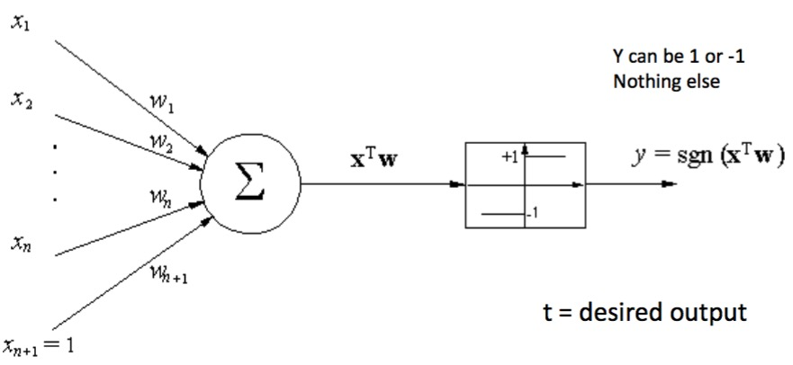

# Mid Review

+ Concept Space = All possible concepts
	+ $Size = 2^{Size\;of\;input\;space}$
+ Hard bias makes hypothesis space smaller than concept space

## Information Theory

+ Surprise of $I(x)=log_2(\frac{1}{P(x)})$
+ Entropy $H(X)=\sum_xP(x)\times I(x)$
+ Avg. Cond. $H(X\;|\;Y)=\sum_yP(y)\times H(X\;|\;Y=y)$
+ Mutual Information $I(X;Y)=H(X)-H(X\;|\;Y)$
+ Chain Rules:
	+ $I(Y;X1,X2)=I(Y;X1)+I(Y;X2\;|\;X1)$
	+ $H(X,Y)=H(X)+H(Y\;|\;X)$
	+ $P(x,y)=P(x)\times P(y\;|\;x)$

## Probability

+ $P(x,y)=P(x)P(y\;|\;x)$
+ $E[X]=\sum_xP(x)x$
+ $E_{sample}[X]=\frac{1}{N}\sum_{i=1}^Nx_i$
+ $Var(2X+3Y)=4\;Var(X)+9\;Var(Y)+12\;Cov(X,Y)$
+ Linear Correlation can be 0 even if MI > 0
+ Independence: $x\perp y \to p(x,y)=p(x)\;p(y)$
+ Node the same: $x\perp y \;|\;z \to p(x,y\;|\;z)=p(x\;|\;z)\;p(y\;|\;z)$

## Hypothesis Testing

+ How certain can we be that our sample error is close to the real error
+ Give an interval together with certain confidence: $<confidence, Mean \pm z\times Var.>$
+ Recipe:
	1. identify what to estimate (P)
	2. Define estimator (e.g. MLE)
	3. Determine mean and variance of estimator
	4. Determine bounds covering N% confidence	
## MLE and MAP

MLE: Known Likelihood function $P(X\;|\;\lambda)$

+ Find maximum via setting derivative wrt. $\lambda$ to 0
+ Steps:
	1. Remove terms in likelihood not depending on $\lambda$
	2. Take log to make math easier
	3. Take partial derivative wrt. $\lambda$
	4. Set to 0 and solve for $\lambda$

MAP: also use prior over $\lambda$: $P(\lambda)$ Prior pushes parameters into certain direction(s)

## Bayes Optimal Classifier

+ $argmax_y\sum_{h\in H}P(y|h)P(h|D)$
+ Smallest error among all classifiers that use this particular hpyothesis space H
+ Problem: Need to enumerate all hypothesis in H
+ Solution: Gibbs Algorithm, MAP
+ Bayes Rule: $P(y|D)=\frac{P(y)P(D|y)}{P(D)}$
+ Remaining Problem: Estimate $P(D|y)$ and $P(D)$

## Naive Bayes

+ Observation $P(D)$ not needed if we only want to argmax over the class
+ Idea fro $P(D|y)$: assume attributes condintionally independent
	+ $P(D|y)=P((x_1, x_2, x_3)\;|\;y)=P(x_1\;|\;y)P(x_2\;|\;y)P(x_3\;|\;y)$
	+ Now we can just count each feature
+ This is a **very Strong** assumption. Duplicate features get overweighted

## Graphical Models

+ Bayes Net(directed)
	+ Node independent of its non-descendants **conditioned** on its parents
	+ Direction represented belief about causality. Independence is undirected
+ Markov Random Field (undirected)
	+ Node independent of Non-neighbors **conditioned** on neighbors

## Hidden Markov Models

+ Remember $\alpha_1(j)=b_j(o_1)\pi_j$
+ Remember $\beta_T(i)=1.0$
+ Alpha and Beta defined to match $\alpha_t(i)\beta_t(i)=P(q_t=i,O\;|\;\lambda)$

State Name | t=1 | t=2 | T=t=3
:--: | :--: | :--: | :--:
Admits Guilt | $\alpha_1(A)\beta_1(A)$ | $\alpha_2(A)\beta_2(A)$ | $\alpha_T(A)\beta_T(A)$
Threatens | $\alpha_1(T)\beta_1(T)$ | $\alpha_2(T)\beta_2(T)$ | $\alpha_T(T)\beta_T(T)$
Other | $\alpha_1(O)\beta_1(O)$ | $\alpha_2(O)\beta_2(O)$ | $\alpha_T(O)\beta_T(O)$
Sum $\sum$ col | $P(O\;\vert \;\lambda)$ | $P(O\;\vert \;\lambda)$ | $P(O\;\vert \;\lambda)$

## Expectation Maximization

+ What to do when MLE does not work? EM
	+ E-step: based on current parameters assign(hidden) labels to training data
	+ M-step: based on labeling calculate better parameters 
+ Baum-Welch for training HMM unsupervised is an instance of EM
+ Kmeans clustering another instance

## Perceptron

+ Training Rule: $w_{new} = w_{old} + \eta(y-t)x$
+ Converges if Xs are linearly separable

## Neural Networks

+ What is the bias of neural networks?
+ Backpropagation finds only a local optimum
+ NN Design Questions
	+ How many layers? (Deep vs. shallow)
	+ How many hidden units? (vs. Overfitting)
	+ How connected? (Features...)
+ Problem of deep networks: Vanishing gradient
+ General Problem: Non-convexity

